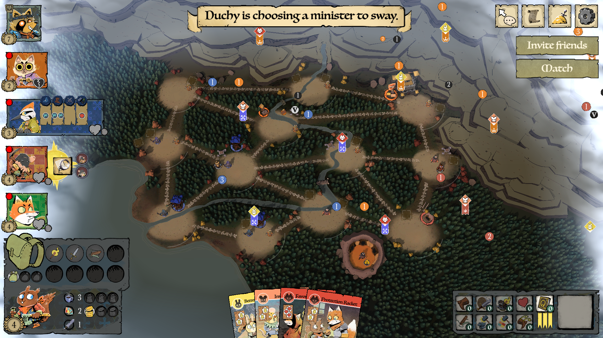
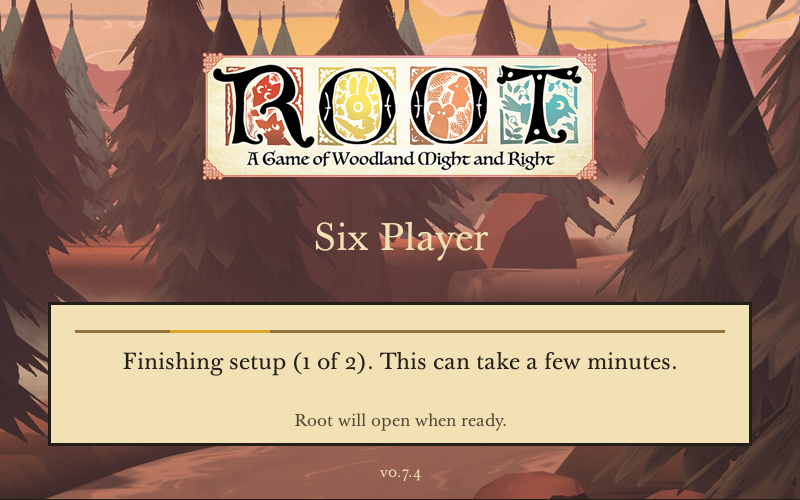
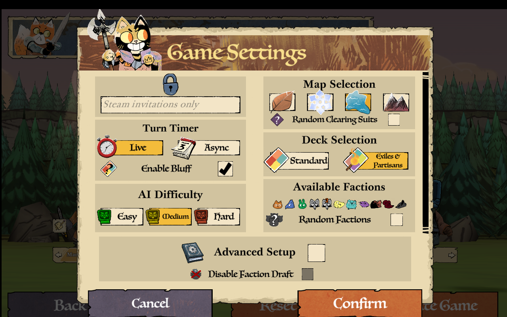

# Root Six Player

A mod and launcher for private six-player games of [Root](https://store.steampowered.com/app/965580/Root/) with Steam friends, on Windows and Linux.

## Download

**[Download Root Six Player](https://github.com/AugusDogus/root-six-player/releases/latest)**

| System | Download and run |
| --- | --- |
| Windows | Run `RootSixPlayer-…-Setup.exe`, then open **Root Six Player** from the Start menu |
| Linux | Download `RootSixPlayer-…-x86_64.AppImage`, allow it to run as a program in file properties, then open it |

The launcher finds Root, sets up a separate modded copy, and opens the game. First launch can take a few minutes. Everyone in a match should use the same release.

Downloads require access to this private repository.

## Requirements

| Component | Requirement |
| --- | --- |
| Platform | Windows or Linux, x86_64 |
| Game | Root installed through Steam, version **2.1.5**, build **22238765** |
| Steam | Running and signed in |
| Linux | Proton Experimental and Steam Linux Runtime 4, installed through Steam |

## Features

- Six seats for friends, faction AI, or Clockwork bots.
- Steam invitations and peer-to-peer multiplayer.
- Root's faction selection, maps, decks, and advanced setup.
- In-game chat, turn timers, autosaves, and match recovery.
- All installed gameplay expansions available in the private playtest.

## Play with friends

1. **Host:** open the launcher, choose **Host a game**, configure the seats and game options, and create the room.
2. **Invite:** choose **Invite friends**, select an open human seat, and send a Steam invitation.
3. **Join:** friends open their launcher and choose **Join friends** before accepting the invitation. Each friend chooses a faction in the waiting room and clicks **Join Game**.
4. **Start:** the host starts the match once everyone has joined.

Open the mod before accepting an invitation, or Steam will open ordinary Root. Keep the host's game running while playing.

Matches save automatically. To continue later, the host chooses **Resume a game** and sends new invitations. Active turn timers continue while the host is closed.

## Updates and troubleshooting

The launcher checks for updates when opened. On Windows, it updates the installed launcher and restarts. On Linux, it replaces the AppImage in place and restarts. Keep it in a writable folder and use the same file each time. Updates preserve compatible saved matches. Close Root before updating.

Windows users upgrading from 0.7.5 or earlier need to run Setup once. Linux users upgrading from 0.7.4 or earlier need to download the AppImage once.

If Linux reports that FUSE is unavailable, run the AppImage with `--appimage-extract-and-run`.

Automatic updates need public release downloads. While this repository is private, download newer launchers from the release page. A failed update check keeps the installed version usable.

If something goes wrong, use **Copy diagnostics** in the **Match** menu or on the error screen. Include that text when [reporting an issue](https://github.com/AugusDogus/root-six-player/issues).

## Playtest status

Experimental. Steam invitations between different accounts, Internet play, and native Windows gameplay still need real-player testing.

## Development

[Build and test](docs/development.md) · [CI and releases](docs/launcher-ci.md) · [UI audit](docs/native-ui-audit.md) · [Release notes](RELEASE.md)

[Screenshot provenance](docs/screenshots/README.md). Bundled dependencies include their license notices and corresponding sources where required.
